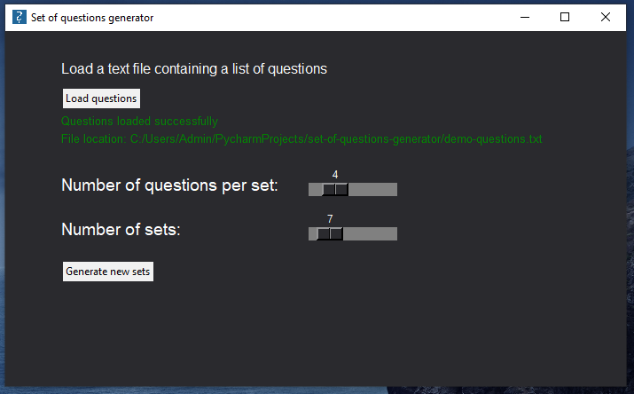

# Set of questions generator
Application allows generating sets of questions.

## Usage

#### Initial state allows loading a file containing questions:

#### After clicking "Load questions" button, specify a text file with questions:

#### Example contents of a questions file. Questions are enumerated and listed line by line:

#### Set number of sets and number of questions per set:

#### Sets generated successfully

#### After clicking "Generate new sets" button, choose a location to save a text file containing generated sets:

#### File with generated sets opens automatically. Contents of generated file:

